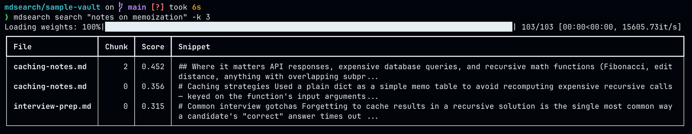

# mdsearch

[](https://pypi.org/project/mdsearch-cli/)
[](https://pypi.org/project/mdsearch-cli/)
[](LICENSE)

Semantic search over a folder of markdown files — built for Obsidian vaults,
but works on any directory of `.md` notes.

Instead of grepping for exact words, `mdsearch` finds notes that are *about*
what you're asking, even if they never use your exact phrasing. It chunks
your notes, embeds each chunk with a local sentence-transformers model,
stores the vectors in a FAISS index, and searches by cosine similarity.

This was originally built so [Claude](https://claude.com) could search an
Obsidian vault intelligently via MCP — see
[docs/MCP_SETUP.md](docs/MCP_SETUP.md) for wiring it up with Claude Desktop.
It works standalone as a CLI too.

## Why

Filename and grep search only find notes that contain your literal words. If
you wrote "used a dictionary to cache API responses" six months ago and
search for "memoization", grep finds nothing — `mdsearch` finds it, because
the embedding model understands the two phrases are related.

## Install

```bash
brew install pipx   # if you don't already have it
pipx install mdsearch-cli
```

`pipx` installs the CLI into its own isolated environment and puts
`mdsearch` on your `PATH` — the right way to install a Python *application*
rather than a library. If you'd rather use plain `pip`, do it inside a
virtualenv:

```bash
python3 -m venv .venv && source .venv/bin/activate
pip install mdsearch-cli
```

(A bare `pip install mdsearch-cli` outside a venv fails with an
"externally managed environment" error on Homebrew's Python — that's
[PEP 668](https://peps.python.org/pep-0668/), and it applies to every
package, not just this one. `pipx` or a venv is the fix, not
`--break-system-packages`.)

The package is named `mdsearch-cli` on PyPI (`mdsearch` was already taken by
an unrelated project), but it installs the same `mdsearch` command and
`mdsearch.*` Python package.

To install from source instead:

```bash
git clone https://github.com/Nakshh/mdsearch.git
cd mdsearch
pip install -e .
```

Requires Python 3.11+. The first run downloads a small embedding model
(`all-MiniLM-L6-v2`, ~90MB) from Hugging Face and caches it locally.

### A Hugging Face token is required

`index` and `search` both refuse to run without one — get a free token and
export it before using either command:

```bash
export HF_TOKEN=hf_your_token_here                     # get one: https://huggingface.co/settings/tokens
echo 'export HF_TOKEN=hf_your_token_here' >> ~/.zshrc  # persist it across sessions
```

## Usage

### Try it right now

The repo ships a small, non-personal [sample vault](sample-vault) so you can
see semantic search work immediately, no vault of your own required:

```bash
git clone https://github.com/Nakshh/mdsearch.git
cd mdsearch/sample-vault
mdsearch index
mdsearch search "notes on memoization" -k 3
```



None of the four notes in that vault contain the word "memoization" — but
`mdsearch` ranks the two notes about caching recursive results at the top,
puts the interview-prep note (which only mentions caching in passing) third,
and correctly leaves out the unrelated focaccia recipe entirely.

### On your own vault

Build (or incrementally update) the index — `vault_path` defaults to the
current directory, same as `search`:

```bash
$ mdsearch index ~/ObsidianVault
Indexed. added=142 updated=0 removed=0 unchanged=0 chunks=891 (38.42s)
```

Then search the same way as above, just pointing `--vault-path` at it
instead of `sample-vault`.

Re-running `index` on an unchanged vault is a near-instant no-op — every
file's content hash is checked against a manifest, and only changed or new
files get re-embedded:

```bash
$ mdsearch index ~/ObsidianVault
Indexed. added=0 updated=0 removed=0 unchanged=142 chunks=891 (0.01s)
```

### Commands

| Command | Description |
|---|---|
| `mdsearch index [vault_path]` | Build or incrementally update the index for a vault; defaults to the current directory. |
| `mdsearch search <query>` | Search an already-indexed vault. |
| `mdsearch --version` | Print the installed version. |

### `index` options

| Flag | Description |
|---|---|
| `--force`, `-f` | Re-embed every file regardless of content hash. |

### `search` options

| Flag | Description |
|---|---|
| `--top-k`, `-k` | Number of results to return (default 5, must be ≥ 1). |
| `--vault-path` | Vault to search; defaults to the current directory. Must already be indexed. |

The index lives at `<vault_path>/.mdsearch` — inside the vault itself, so it
travels with the vault and doesn't depend on where you run the command from.

## Architecture

```
markdown files -> chunk -> embed -> FAISS index -> search
```

- **Chunking**: each `.md` file is split on heading boundaries, with a hard
  fallback split for oversized sections, so chunks stay small and topical.
- **Embedding**: chunks are encoded with a local `sentence-transformers`
  model (default `all-MiniLM-L6-v2`) — no API calls, no data leaves your
  machine.
- **Indexing**: vectors are L2-normalized and stored in a FAISS
  `IndexFlatIP`, so inner product search is equivalent to cosine similarity.
  It's an exact, brute-force index rather than an approximate one (HNSW,
  IVF, ...) — at the scale of a personal vault (thousands, not millions, of
  chunks) exact search is fast enough and there's no accuracy tradeoff to
  make.
- **Incremental updates**: a per-file sha256 manifest is stored alongside
  the index. On re-index, unchanged files reuse their cached vectors
  instead of being re-embedded, so re-running `index` on a mostly-unchanged
  vault is near-instant.
- **Metadata**: chunk text and file/chunk IDs are stored as human-readable
  JSONL, not pickled, so the index directory is easy to inspect or diff.

## MCP server

`mdsearch` also ships an MCP server so an AI assistant (e.g. Claude Desktop)
can search your vault directly. See [docs/MCP_SETUP.md](docs/MCP_SETUP.md)
for setup instructions.

## License

MIT — see [LICENSE](LICENSE).
